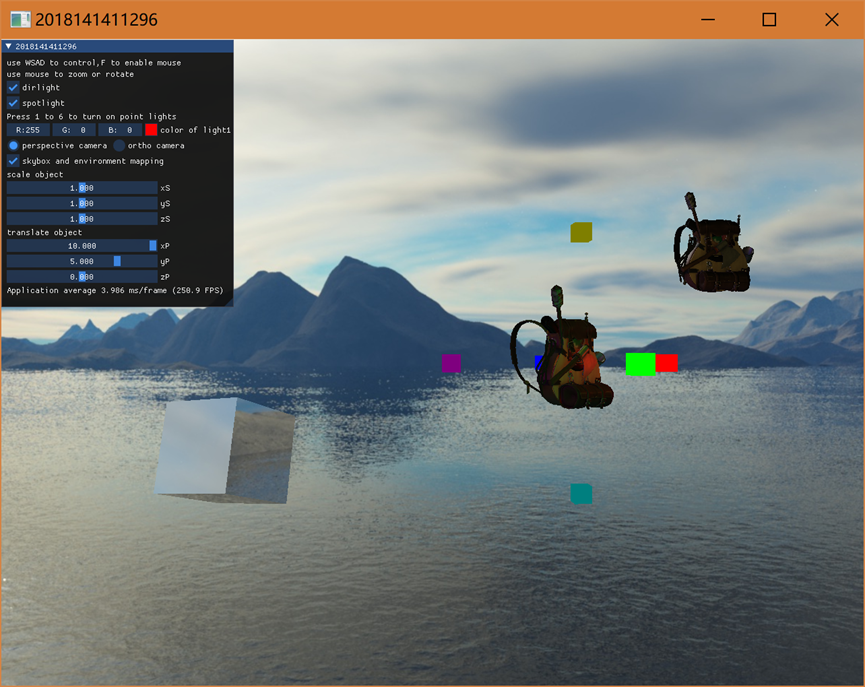

# graphicsProject2
计算机图形学期末项目


交互操作简要说明：

采用Dear ImGui实现可视化操作，通过WSAD控制摄像机，在键盘按下F后可以开启或关闭鼠标的使用，建议关闭鼠标视角移动后，然后与GUI交互。通过勾选开启平行光和聚光，通过键盘1至6开启点光源，并且在GUI上可以通过调色板控制点光源1的颜色。通过勾选调整正交投影或透视投影，通过滑动条调整其中一个背包的model矩阵，xyz轴方向平移或缩放。GUI同时显示帧率。





## 详细设计：

本设计模拟绘制真实感场景，通过导入网格建模方法建模的背包模型，并将若干立方体放置在天空盒中，键盘鼠标交互实现对景物的漫游观察，并进行真实感着色渲染。采用的技术有网格表模型加载，模型变换，观察变换，投影变换，窗区视区变换，Blinn-Phong光照模型，光照贴图, 法线贴图, 立方体贴图，反射贴图等……。

### 1 概 要
   使用c++ ，glsl语言编程，在opengl这个规范下，采用3.3版本核心模式。实现了使用Open Asset Import Library（Assimp）库加载blender建模的外部网格模型。将背包加载到Scene对象中，遍历节点，获取对应的Mesh对象，并处理每个Mesh对象来获取顶点数据、索引以及它的材质属性。最终的结果是一系列的网格数据，将它们包含在一个Model对象中来绘制背包模型。并且采用写死在c++中用数组包括立方体顶点数据和法线数据来绘制具有环境纹理的立方体和光源，当然还有天空盒。
    可切换正交投影和透视投影，当然天空盒只能是透视投影。本项目的摄像机系统是一个FPS风格的摄像机，通过键盘自由移动，而且与欧拉角兼容，可以用鼠标实现视角移动。可以通过GUI控制模型变换，对背包模型平移和缩放，物体本身有在旋转。
    光源总共有1个定向光，6个不同位置的点光源，还有1个聚光灯。外部导入背包模型的时候一同传入了漫反射贴图，镜面光贴图，法线贴图。这里采用的是布林—冯着色模型，在镜面反射系数计算的时候用中向量和法向量计算，效果比冯着色好且代价几乎没有。因为环境光颜色在几乎所有情况下都等于漫反射颜色，所以漫反射光通过纹理采样器sampler2D在漫反射贴图映射后得到颜色乘以漫反射系数和光强即可，环境光也算出。镜面反射同理通过纹理采样器在镜面光贴图得到值。取样对应的颜色值并将它乘以光源的镜面强度和系数。一个像素越白，乘积就会越大，物体的镜面光分量就会越亮。背包不同的地方镜面光看起来不同，木头和金属不可同日而语。对于点光源还需引入距离和光强衰减，聚光在此之上还需平滑聚光边缘。
    当然背包模型凹凸不平。每个fragment都是用自己的不同的法线，这样就可以根据表面细微的细节对法线向量进行改变，这样就会获得一种表面看起来要复杂得多的幻觉。但是模型法线贴图里面的所有法线向量都是指向正z方向的。而模型可不全是，因此引入切线空间（tangent space）。在一个不同的坐标空间中进行光照，这个坐标空间里，法线贴图向量总是指向这个坐标空间的正z方向；所有的光照向量都相对与这个正z方向进行变换。这样我们就能始终使用同样的法线贴图，不管朝向问题。
    此外，本项目还使用了将多个纹理组合起来映射到一张纹理上的立方体贴图(Cube Map)。将整个环境映射到了一个纹理对象，利用这个信息得到天空盒。通过使用环境的立方体贴图，及用环境映射(Environment Mapping)实现反射(Reflection)效果，得到像是镜子一样的立方体。周围的天空盒被完美地反射在立方体上。

### 2 项目设计


#### 2.1 场景物体模型设计
    对于场景中的立方体和光源直接手工定义所有的顶点、法线

   为了解析模型文件以及提取所有有用的信息，将它们储存为OpenGL能够理解的格式。采用一个非常流行的模型导入库是Assimp，当使用Assimp导入一个模型的时候，它通常会将整个模型加载进一个场景(Scene)对象，它会包含导入的模型/场景中的所有数据。Assimp会将场景载入为一系列的节点(Node)，每个节点包含了场景对象中所储存数据的索引，每个节点都可以有任意数量的子节点。

   通过使用Assimp加载模型到程序中，但是载入后它们都被储存为Assimp的数据结构。最终仍要将这些数据转换为OpenGL能够理解的格式。网格(Mesh)代表的是单个的可绘制实体，一个网格应该至少需要一系列的顶点，每个顶点包含一个位置向量、一个法向量和一个纹理坐标向量。一个网格还应该包含用于索引绘制的索引以及纹理形式的材质数据（漫反射/镜面光贴图）。
Model和Mesh类来加载并使用刚刚介绍的结构储存导入后的模型。如果想要绘制一个模型，不需要将整个模型渲染为一个整体，只需要渲染组成模型的每个独立的网格就可以了。Assimp数据结构的（简化）模型如下：

    图2-2 Assimp数据结构图

定义网格类的结构：

```cpp
class Mesh {
    public:
        /*  网格数据  */
        vector<Vertex> vertices;
        vector<unsigned int> indices;
        vector<Texture> textures;
        /*  函数  */
        Mesh(vector<Vertex> vertices, vector<unsigned int> indices, vector<Texture> textures);
        void Draw(Shader shader);
    private:
        /*  渲染数据  */
        unsigned int VAO, VBO, EBO;
        /*  函数  */
        void setupMesh();
};  
```
  在构造器中，将所有必须的数据赋予了网格，在setupMesh函数中初始化缓冲，并最终使用Draw函数来绘制网格。

  Model类包含了一个Mesh对象的vector<Mesh>。在构造器中，它会直接通过loadModel来加载文件。私有函数将会处理Assimp导入过程中的一部分。储存文件路径的目录，加载纹理的时候还会用到。Draw函数遍历了所有网格，并调用它们各自的Draw函数。
  
```cpp
  class Model 
{
    public:
        /*  函数   */
        Model(char *path)
        {
            loadModel(path);
        }
        void Draw(Shader shader);   
    private:
        /*  模型数据  */
        vector<Mesh> meshes;
        string directory;
        /*  函数   */
        void loadModel(string path);
        void processNode(aiNode *node, const aiScene *scene);
        Mesh processMesh(aiMesh *mesh, const aiScene *scene);
        vector<Texture> loadMaterialTextures(aiMaterial *mat, aiTextureType type, 
                                             string typeName);
};
```
#### 2.2 观察中的各种变换设计
有个易于使用，专门为OpenGL量身定做的数学库，那就是GLM。本项目就基于此库。
    
#### 2.2.1物体变换
物体变换直接采用glm的translate、scale、rotate，用法如下
```cpp
model = glm::translate(model, glm::vec3(xPosition, yPosition, zPosition));
model = glm::scale(model, glm::vec3(xScale,yScale,zScale));
model = glm::rotate(model, 0.3f, glm::vec3(0.0f, 1.0f, 0.0f));
```
#### 2.2.2相机变换
   摄像机/观察空间(Camera/View Space)是在讨论以摄像机的视角作为场景原点时场景中所有的顶点坐标：观察矩阵把所有的世界坐标变换为相对于摄像机位置与方向的观察坐标。要定义一个摄像机，需要它在世界空间中的位置、观察的方向、一个指向它右测的向量以及一个指向它上方的向量。实际上创建了一个三个单位轴相互垂直的、以摄像机的位置为原点的坐标系。
   摄像机位置简单来说就是世界空间中一个指向摄像机位置的向量。摄像机的方向，这里指的是摄像机指向哪个方向。让摄像机指向场景原点：(0, 0, 0)。用场景原点向量减去摄像机位置向量的结果就是摄像机的指向向量。由于摄像机指向z轴负方向，但希望方向向量(Direction Vector)指向摄像机的z轴正方向。如果交换相减的顺序，就会获得一个指向摄像机正z轴方向的向量：

```cpp
glm::vec3 cameraTarget = glm::vec3(0.0f, 0.0f, 0.0f); 
glm::vec3 cameraDirection = glm::normalize(cameraPos - cameraTarget);
```
   右向量代表摄像机空间的x轴的正方向。为获取右向量需要先定义一个上向量，接下来把上向量和得到的方向向量进行叉乘。两个向量叉乘的结果会同时垂直于两向量，因此会得到指向x轴正方向的那个向量
```cpp
glm::vec3 up = glm::vec3(0.0f, 1.0f, 0.0f); 
glm::vec3 cameraRight = glm::normalize(glm::cross(up, cameraDirection));
```
   现在已经有了x轴向量和z轴向量，获取一个指向摄像机的正y轴向量就相对简单了：把右向量和方向向量进行叉乘：
```cpp
glm::vec3 cameraUp = glm::cross(cameraDirection, cameraRight);
```
GLM可以创建一个LookAt矩阵，可以把它当作观察矩阵：
```cpp
glm::mat4 view; 
view = glm::lookAt(glm::vec3(0.0f, 0.0f, 3.0f), 
glm::vec3(0.0f, 0.0f, 0.0f), 
glm::vec3(0.0f, 1.0f, 0.0f));
```
   
    图2-3 LookAt矩阵
   为了移动摄像机首先必须设置一个摄像机系统，将摄像机位置设置为之前定义的cameraPos。方向是当前的位置加上刚刚定义的方向向量。这样能保证无论怎么移动，摄像机都会注视着目标方向。在按下某些按钮时更新cameraPos向量，让GLFW监听按键事件。
```cpp
glm::vec3 cameraPos = glm::vec3(0.0f, 0.0f, 3.0f);
glm::vec3 cameraFront = glm::vec3(0.0f, 0.0f, -1.0f);
glm::vec3 cameraUp = glm::vec3(0.0f, 1.0f, 0.0f);
view = glm::lookAt(cameraPos, cameraPos + cameraFront, cameraUp);

void processInput(GLFWwindow *window) 
{ 
float cameraSpeed = 0.05f; 
if (glfwGetKey(window, GLFW_KEY_W) == GLFW_PRESS) 
cameraPos += cameraSpeed * cameraFront; 
if (glfwGetKey(window, GLFW_KEY_S) == GLFW_PRESS) 
cameraPos -= cameraSpeed * cameraFront; 
if (glfwGetKey(window, GLFW_KEY_A) == GLFW_PRESS) 
cameraPos -= glm::normalize(glm::cross(cameraFront, cameraUp)) * cameraSpeed; 
if (glfwGetKey(window, GLFW_KEY_D) == GLFW_PRESS) 
cameraPos += glm::normalize(glm::cross(cameraFront, cameraUp)) * cameraSpeed; 
}
```
    
   为了能够改变视角，我们需要根据鼠标的输入改变cameraFront向量。欧拉角(Euler Angle)是可以表示3D空间中任何旋转的3个值，由莱昂哈德·欧拉(Leonhard Euler)在18世纪提出。一共有3种欧拉角：俯仰角(Pitch)、偏航角(Yaw)和滚转角(Roll)， 俯仰角是描述我们如何往上或往下看的角，可以在第一张图中看到。第二张图展示了偏航角，偏航角表示我们往左和往右看的程度。滚转角代表我们如何翻滚摄像机，通常在太空飞船的摄像机中使用。每个欧拉角都有一个值来表示，把三个角结合起来我们就能够计算3D空间中任何的旋转向量了。
```cpp
direction.x = cos(glm::radians(pitch)) * cos(glm::radians(yaw)); 
direction.y = sin(glm::radians(pitch)); 
direction.z = cos(glm::radians(pitch)) * sin(glm::radians(yaw));
cameraFront = glm::normalize(direction);
```
    
需要让GLFW监听鼠标移动事件。和键盘输入相似用一个回调函数来完成，函数的原型如下：
```cpp
void mouse_callback(GLFWwindow* window, double xpos, double ypos);
```
#### 2.2.3规范化投影变换 
投影变换也是主要采用glm函数库提供的功能。正交投影和透视投影矩阵构造大致如下
```cpp
projection = glm::perspective(glm::radians(camera.Zoom), (float)SCR_WIDTH / (float)SCR_HEIGHT, 0.1f, 100.0f);
float ratio = (float)SCR_WIDTH / SCR_HEIGHT;
projection = glm::ortho(-ratio, ratio, -1.0f, 1.0f, 0.1f, 100.0f);

```
 
    图2-4 正交投影矩阵

    
    图2-5 透视投影矩阵
#### 2.2.4视口变换
两个范围空间的转换[−1,1] ^2→[0,width]∗[0,height] 
    
    图2-6 视口变换矩阵
### 2.3真实感着色设计
   现实世界的光照是极其复杂的，而且会受到诸多因素的影响，因此OpenGL的光照使用的是简化的模型，对现实的情况进行近似，光照模型都是基于我们对光的物理特性的理解。其中一个模型被称为冯氏光照模型(Phong Lighting Model)。冯氏光照模型的主要结构由3个分量组成：环境(Ambient)、漫反射(Diffuse)和镜面(Specular)光照。本项目采用改进后的Blinn-Phong模型，和冯模型的差别主要是在镜面反射上。
    
    图2-7 Blinn-Phong镜面反射系数计算
对于平行光，最后的颜色由ambient 、diffuse 、 specular求和得来。
```cpp
// 漫反射
    vec3 lightDir = normalize(-light.direction);
    float diffuseFactor = max(dot(normal, lightDir), 0.0f);
    
    // 镜面反射
    vec3 halfway = normalize(lightDir + viewDir);
    float spceularFactor = pow(max(dot(halfway, normal), 0.0f), 32);

    // 计算环境光，漫反射光和镜面光
    vec3 ambient = diff * light.ambient;
    vec3 diffuse = diff * light.diffuse * diffuseFactor;
    vec3 specular = spec * light.specular * spceularFactor;
    
    return ambient + diffuse + specular;
```
   现实世界中的物体通常并不只包含有一种材质，而是由多种材质所组成。对于本项目导入的背包模型，它的金属部分非常有光泽，木质结构不会那么有光泽，所以它没有镜面高光。背包同样会有漫反射和环境光颜色，它们在整个物体上也不会是一样的，总之，物体在不同的部件上都有不同的材质属性。由于本项目在计算光照时引引入漫反射和镜面光贴图(Map)。这允许对物体的漫反射分量（以及间接地对环境光分量，它们几乎总是一样的）和镜面光分量有着更精确的控制。

   为了能够把纹理映射(Map)到三角形上，我们需要指定三角形的每个顶点各自对应纹理的哪个部分。这样每个顶点就会关联着一个纹理坐标(Texture Coordinate)，用来标明该从纹理图像的哪个部分采样。之后在图形的其它片段上进行片段插值(Fragment Interpolation)。本项目在导入模型的时候同时加载了纹理。
    
```shader
in VS_OUT{
    vec3 FragPos;
    vec2 TexCoords;
    mat3 TBN;
} fs_in;
    
uniform sampler2D texture_diffuse1;
uniform sampler2D texture_specular1;
//从光照贴图里面读取漫反射和镜面反射纹理
vec3 diff = vec3(texture(texture_diffuse1, fs_in.TexCoords));
vec3 spec = vec3(texture(texture_specular1,fs_in.TexCoords).r);

```
    
   通过向三角形上附加纹理的方式来增加额外细节，隐藏多边形几何体是由无数三角形组成的事实。纹理确有助益。现实中的物体表面并非是平坦的，而是表现出无数（凹凸不平的）细节。如果以光的视角来看这个问题：法线向量使表面被视为完全平坦的表面来照亮。以光照算法的视角考虑的话，只有一件事决定物体的形状，这就是垂直于它的法线向量。如果表面只有一个法线向量，表面完全根据这个法线向量被以一致的方式照亮。如果每个fragment都是用自己的不同的法线，这样就可以根据表面细微的细节对法线向量进行改变；就会获得一种表面看起来要复杂得多的幻觉：每个fragment使用了自己的法线，就可以让光照相信一个表面由很多微小的（垂直于法线向量的）平面所组成，物体表面的细节将会得到极大提升。这种每个fragment使用各自的法线，替代一个面上所有fragment使用同一个法线的技术叫做法线贴图（normal mapping）
   由于法线向量是个几何工具，而纹理通常只用于储存颜色信息，用纹理储存法线向量不是非常直接。纹理中的颜色向量用r、g、b元素代表一个3D向量。类似的也可以将法线向量的x、y、z元素储存到纹理中，代替颜色的r、g、b元素。法线向量的范围在-1到1之间：

```cpp
//从法线贴图范围[0,1]获取法线
    vec3 normal = texture(texture_normal1, fs_in.TexCoords).rgb;
    // 将法线向量转换为范围[-1,1]
    normal = normalize(normal * 2.0f - 1.0f);

```
   但是模型法线贴图里面的所有法线向量都是指向正z方向的。而模型可不全是，因此引入切线空间（tangent space）。在一个不同的坐标空间中进行光照，这个坐标空间里，法线贴图向量总是指向这个坐标空间的正z方向；所有的光照向量都相对与这个正z方向进行变换。这样我们就能始终使用同样的法线贴图，不管朝向问题。Assimp有个很有用的配置，在我们加载模型的时候调用aiProcess_CalcTangentSpace。当aiProcess_CalcTangentSpace应用到Assimp的ReadFile函数时，Assimp会为每个加载的顶点计算出柔和的切线和副切线向量。
```cpp
uniform sampler2D texture_normal1;
//向片元传入结构体
out VS_OUT {               
    vec3 FragPos;
    vec2 TexCoords;
    mat3 TBN;
} vs_out;
//计算切线空间所需的TBN矩阵
    vec3 T = normalize(vec3(model * vec4(aTangent, 0.0f)));
    vec3 N = normalize(vec3(model * vec4(aNormal, 0.0f)));
    vec3 B = normalize(cross(T, N));
    vs_out.TBN = mat3(T, B, N); //传出TBN矩阵
    
//从法线贴图范围[0,1]获取法线
    vec3 normal = texture(texture_normal1, fs_in.TexCoords).rgb;
//引入切线到世界空间变换
    normal = normalize(fs_in.TBN * normal);
```
   在本项目中一共采用了3种光源，平行光如上，而点光源与定向光不同的是它多了三个属性参数，这三个参数 是用来计算衰减公式的三个系数，分别是 constant 常数项，linear 一次项和 quadratic 二次项，它会使得光线强度随距离的增加不断减小并且衰减的幅度也 逐渐减小，这样更接近现实生活中点光源的效果。
   第三种光源是聚光，聚光就是类似手电筒的这种效果，聚光的属性也包括聚光光源的位置，方向，这里我们是用摄像机的位置和朝向来指定的， 还有环境光，漫反射光，和镜面反射光的强度参数以及三个衰减系数，比点光源又多了两个参数分别表示聚光内外圆锥的内外切光角。聚光的效果就相当于是一个圆锥的光效，通过使用两个圆锥来使聚光效果看起来更加平滑。
对点光源
```cpp
// 距离和衰减 
float d = length(light.position - fragPos); 
float attenuation = 1.0 / (light.c + light.l * d + light.q * d * d);
```
   对聚光
   theta 就是光线方向同光源方向的夹角。 Epsilon 是内外圆锥之间的余弦差值，这里我们给出两个切光角，分别形成 内外圆锥。 Intensity 则是我们最终得到的聚光强度，它通过 clamp()函数将 theta 值做了限制，在内圆锥内，强度大于 1.0，在内外圆锥之间，强度在 0.0-1.0 之间，在 外圆锥外，强度为负值。
    
```cpp
// 聚光强度 
float theta = dot(lightDir, normalize(-light.direction)); 
float epsilon = light.cutOff - light.outerCutOff;
float intensity = clamp((theta - light.outerCutOff) / epsilon, 0.0, 1.0);

```
最后将所有光照效果累加
```
// 计算定向光
vec3 result = CalcDirLight(dirLight, viewDir, normal,  diffuse, specular);
// 计算点光源
for (int i = 0; i < 6; i++) {
   result += CalcPointLight(pointLights[i], fs_in.FragPos, viewDir, normal,  diffuse, specular);
    }
 // 计算聚光
result += CalcSpotLight(spotLight,  fs_in.FragPos, viewDir, normal,  diffuse, specular);
    FragColor = vec4(result, 1.0);
```
                      
   此外，本项目还使用了将多个纹理组合起来映射到一张纹理上的立方体贴图(Cube Map)。将整个环境映射到了一个纹理对象，利用这个信息得到天空盒。天空盒是一个包含了整个场景的（大）立方体，它包含周围环境的6个图像，以为处在一个比实际大得多的环境当中。通过使用环境的立方体贴图，及用环境映射(Environment Mapping)实现反射(Reflection)效果，得到像是镜子一样的立方体。周围的天空盒被完美地反射在立方体上。
   简单来说，立方体贴图就是一个包含了6个2D纹理的纹理，每个2D纹理都组成了立方体的一个面。如果假设将这样的立方体贴图应用到一个立方体上，采样立方体贴图所使用的方向向量将和立方体（插值的）顶点位置非常相像。这样只要立方体的中心位于原点，就能使用立方体的实际位置向量来对立方体贴图进行采样了。接下来，可以将所有顶点的纹理坐标当做是立方体的顶点位置。最终得到的结果就是可以访问立方体贴图上正确面(Face)纹理的一个纹理坐标。

   反射这个属性表现为物体（或物体的一部分）反射它周围环境，即根据观察者的视角，物体的颜色或多或少等于它的环境。镜子就是一个反射性物体：它会根据观察者的视角反射它周围的环境。反射的原理并不难。下面这张图展示了如何计算反射向量，并如何使用这个向量来从立方体贴图中采样：

图2-8 反射向量计算
```cpp
in vec3 Normal; 
in vec3 Position; 
uniform vec3 cameraPos; 
uniform samplerCube skybox; 
void main() 
{ 
vec3 I = normalize(Position - cameraPos); 
vec3 R = reflect(I, normalize(Normal)); 
FragColor = vec4(texture(skybox, R).rgb, 1.0); 
}
```
                      
## 3 总结
   对于项目要求完成的部分：建模、观察、着色、特效、交互、文档其实应该完成度是比较高的，但是不足也是很明显的，没有使用设计模式，代码耦合简直高得不像样，但是感觉图形学的代码就是这样牵一发而动全身，为了提高一定的效率。改进方向其实也是有很多点位，比如真的很可惜，没有实现动态环境映射(Dynamic Environment Mapping)，因此背包和光源是没有被反射在立方体上的，失去了一些真实感，还有特别应该完成的阴影部分其实可以做的，点光源和平行光，就是聚光在learn opengl没有教程比较烧脑，其实可以试一试。还有就是没有考虑优化问题，有一些重复的代码，效率如果再提高还可以搞延迟着色。总之，梦想可以无限远，搞个光追不香吗？但是技术力有限，下次搞一搞。

   问题，那当然是一直伴随着这个项目。最起初我也是想用webgl做的，毕竟现成的代码那么多，又花费时间把webgl编程指南通读一遍，细读了重点和代码。但是感觉还是不是很适应，光是shader的运行时编译链接成program教材就有几个版本不同的封装，矩阵库也是不如自己写每个统一，js真心不熟，看看glm多好用。到最后还得面临纹理浏览器安全性问题，虽然服务器很好搭建但不如stb_image方便，但总之半路出家变成opengl和cpp一下子舍弃了很多，但是learn opengl上的教程帮助了我很多。起初搭建环境，cmake glfw和assimp等就浪费了不少时间。不过最后导出为vs配置文件.props,类似xml之后陪环境就是几秒钟的事了，模型导入也是一个坑点，好在有参考。之后gui用上imgui那也是有些迷惑，没有文档和资料，好在源码不是很复杂。回顾之后很多麻烦的糟心事果然还是出在api上，太多了！！！查文档帮助了我很多，谢谢youtube上cherno的教程，看完之后入门舒服多了。也谢谢万琳老师的mooc教程，陈蓉老师上课的讲授，还有助教肖晓及时回复与帮助。

#### 参考文献

                      [1] learnopengl-cn.github.io/

                      [2] www.youtube.com/watch?v=W3gAzLwfIP0&list=PLlrATfBNZ98foTJPJ_Ev03o2oq3-GGOS2

                      [3] http://docs.gl/

                      [4] https://www.icourse163.org/learn/HUST-1003636001?tid=1457257442#/learn/announce
    
